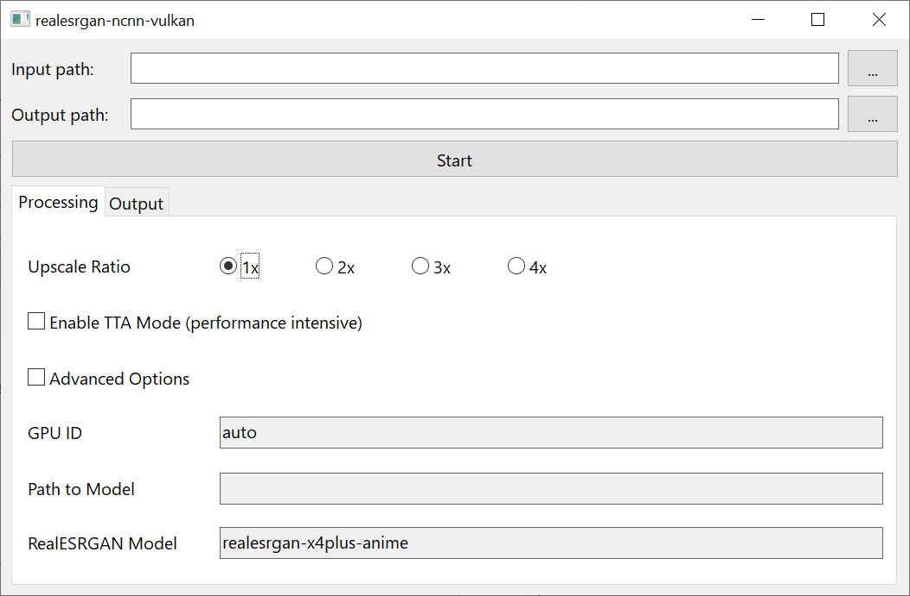

# realesrgan-ncnn-vulkan-gui

A Win32 GUI for [Real-ESRGAN-ncnn-vulkan](https://github.com/xinntao/Real-ESRGAN-ncnn-vulkan).

Essentially the same as [waifu2x-ncnn-vulkan-gui](https://github.com/hch12907/waifu2x-ncnn-vulkan-gui),
just a little modified.

## Usage

1. `cargo build` the project.
2. Copy the resulting `realesrgan-ncnn-vulkan-gui.exe` into `realesrgan-ncnn-vulkan`'s
   main directory.
3. Rename `realesrgan-ncnn-vulkan.exe` into `realesrgan-ncnn-vulkan-cli.exe`.
4. Voila! Just run `realesrgan-ncnn-vulkan-gui.exe` and you should see a GUI popping up.
