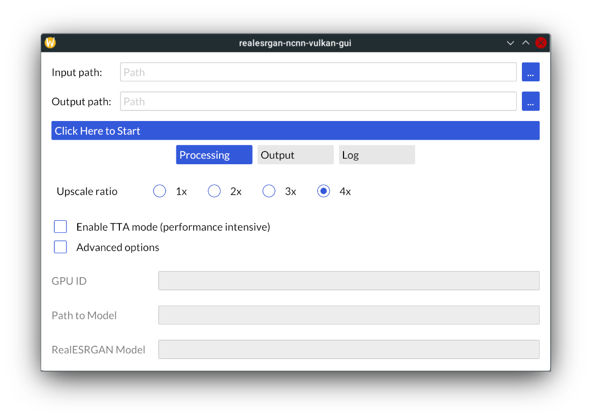

# realesrgan-ncnn-vulkan-gui

A simple GUI for [Real-ESRGAN-ncnn-vulkan](https://github.com/xinntao/Real-ESRGAN-ncnn-vulkan).

For the legacy version (which uses the native Win32 API for GUI), check out the `legacy` branch.

## Usage

1. Download the original `realesrgan-ncnn-vulkan` executable and models.
2. `cargo build` the project.
3. Copy the resulting `realesrgan-ncnn-vulkan-gui` in `target/debug` or `target/release`
   into `realesrgan-ncnn-vulkan`'s main directory.
4. Rename `realesrgan-ncnn-vulkan` into `realesrgan-ncnn-vulkan-cli`.
5. Voila! Just run `realesrgan-ncnn-vulkan-gui` and you should see a GUI popping up.
